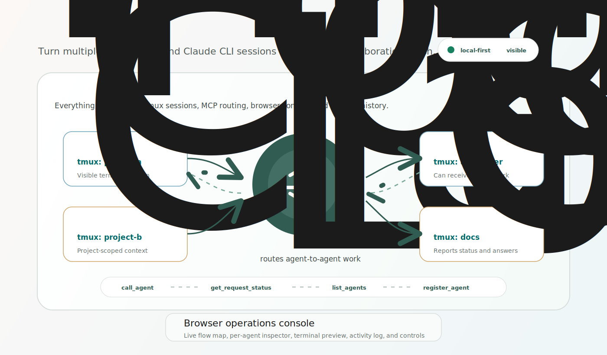

# Mina AI Router

Mina AI Router turns multiple local Codex and Claude CLI sessions into a visible collaboration mesh.

It runs each AI agent in a `tmux` session on your computer, registers the session with a local MCP router, and gives you a browser console to route work, inspect status, open terminal previews, and watch request activity.



GitHub: [stevennana/mina-ai-router](https://github.com/stevennana/mina-ai-router)

## Why Use It

Use Mina AI Router when you want several CLI agents to work together across local projects:

- ask one Codex or Claude session to delegate work to another
- keep every agent visible in `tmux`
- route tasks through local MCP tools instead of copy-pasting between terminals
- see live agent status, capabilities, terminal previews, and request history in one browser console
- keep orchestration local-first on your machine

## Install From GitHub

```sh
git clone https://github.com/stevennana/mina-ai-router.git
cd mina-ai-router
npm install
npm run build
npm link
mair version
```

## Start

```sh
mair server start --port 3333
mair server status
```

Open the Web UI:

```text
http://127.0.0.1:3333/
```

While this server is running, it owns the live router state for that state file. Compatible `mair` CLI reads and writes route through the running server, so `mair health`, `mair agents`, the Web UI, and the MCP endpoint agree on busy/available status without a restart.

`mair server start` reports success only after the local Mina health endpoint is ready. If startup fails because the port is occupied, or a stale pid file points at a non-Mina process, Mina reports an actionable diagnostic instead of a healthy-looking server.

## Connect Codex or Claude

Run setup from the project you want an agent to work in. It discovers the matching running router URL, configures MCP, installs the registration skill, and verifies the client profile.

```sh
mair setup codex --project /path/to/project
mair setup claude --project /path/to/project
mair doctor --client all --project /path/to/project
```

Manual MCP repair commands are still documented in the MCP Client Setup guide for unusual client profiles.

## Create an Agent

From a project directory:

```sh
mair codex
```

or:

```sh
mair claude
```

You can also create agents from the Web UI by right-clicking the `Live Agent Flow` area and choosing `Create tmux Agent`.

Newly created agents move through explicit readiness states instead of silently appearing ready. The UI and CLI can show `created`, `permission-required`, `mcp-configuring`, `registration-pending`, `ready`, or `failed`. If a Codex or Claude session is waiting for trust approval or MCP setup, the agent is not treated as ready for collaboration until that blocker is visible and resolved.

## Collaborate Between Agents

From a registered Codex or Claude session, ask it to use Mina AI Router:

```text
Use Mina AI Router to ask api_server:
Which REST endpoint should this frontend call for user lookup?
Summarize the method, endpoint, parameters, and source files.
```

The source agent calls MCP `list_agents`, selects a target, sends the task with `call_agent`, and waits for the routed answer.

Mina passes caller identity into MCP results so an agent can recognize itself. `list_agents` marks the caller with `isSelf`, and `call_agent` rejects accidental self-calls unless `allowSelfCall: true` is provided for diagnostics.

## Inspect Reliability

The browser console is built for local live operations, not hidden background orchestration. During a two-agent collaboration you can:

- open the routed request detail to inspect lifecycle, parsed answer, raw terminal evidence, and parser diagnostics
- retry, cancel, archive, unarchive, interrupt, or mark recovered requests from the activity panel
- distinguish fresh, stale, missing, generated, manually edited, strong, thin, and missing capability profiles
- inspect MCP preflight state and permission/trust blockers before a new CLI session is routed work
- recover long transactions where the router timed out but the target terminal may still be running
- see health states shared by the CLI and UI: `available`, `busy`, `stale`, `missing`, `needs-attention`, and `unknown`
- use `mair health`, `mair agents`, and `mair agent <id>` to confirm the same status model from a terminal
- trust `mair health` to report the MCP URL for the matching running server, including non-default ports
- see active server-routed requests as `busy` from both the browser and CLI read commands

## What You Get

- Local HTTP UI at `http://127.0.0.1:3333/`
- Local MCP endpoint at `http://127.0.0.1:3333/mcp`
- `mair` CLI for server and agent controls
- Browser operations console with live flow, inspector, terminal preview, and activity log
- Agent capability summaries, structured capability profiles, readiness state, and editable metadata
- MCP tools: `list_agents`, `register_agent`, `call_agent`, `get_request_status`
- Repo-local skill for agent self-registration

## Guides

- [Roadmap](https://github.com/stevennana/mina-ai-router/blob/main/ROADMAP.md)
- [Getting Started](https://github.com/stevennana/mina-ai-router/blob/main/docs/GETTING-STARTED.md)
- [User Start Guide](https://github.com/stevennana/mina-ai-router/blob/main/docs/USER-START-GUIDE.md)
- [MCP Client Setup](https://github.com/stevennana/mina-ai-router/blob/main/docs/MCP-CLIENT-SETUP.md)
- [Skill Install Guide](https://github.com/stevennana/mina-ai-router/blob/main/docs/SKILL-INSTALL-GUIDE.md)
- [HTTP UI and MCP Server](https://github.com/stevennana/mina-ai-router/blob/main/docs/HTTP-UI-MCP.md)
- [Troubleshooting](https://github.com/stevennana/mina-ai-router/blob/main/docs/TROUBLESHOOTING.md)
- [Release Guide](https://github.com/stevennana/mina-ai-router/blob/main/docs/RELEASE.md)

## Development

```sh
git clone https://github.com/stevennana/mina-ai-router.git
cd mina-ai-router
npm install
npm run verify
```
