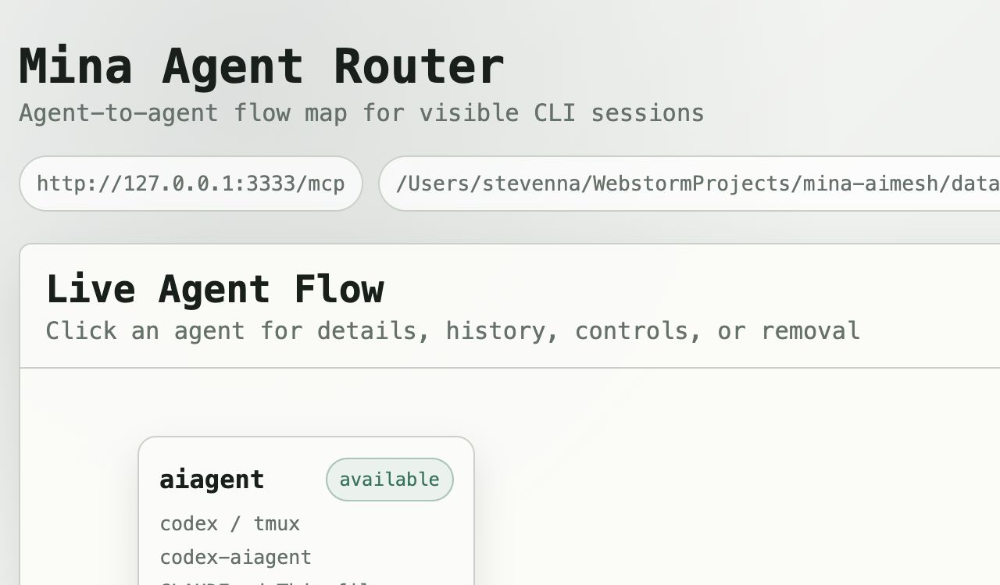
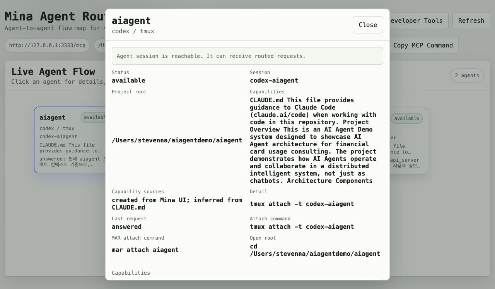
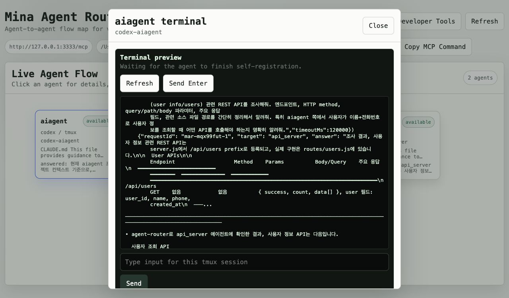

# User Start Guide

This guide is for someone who wants to use Mina AI Router, not develop it.

## What You Will Set Up

You will:

1. Install the `mair` command.
2. Start the local router and Web UI.
3. Connect Codex or Claude to the local MCP server.
4. Install the agent registration skill.
5. Create visible tmux-backed agents.
6. Inspect and control agents from the browser.

## 1. Install the `mair` Command

Install the published package:

```sh
npm install -g @minsoft/mina-ai-router
```

Verify:

```sh
mair version
```

Expected output:

```json
{
  "name": "@minsoft/mina-ai-router",
  "version": "0.1.0"
}
```

## 2. Start the Router

```sh
mair server start --port 3333
mair server status
```

Open:

```text
http://127.0.0.1:3333/
```

The center node is the local MCP router. The surrounding nodes are registered agents.



## 3. Connect Your AI CLI to MCP

Pick the guide for the CLI you use:

- Codex: [Codex MCP Setup](./MCP-CLIENT-SETUP.md#codex)
- Claude: [Claude MCP Setup](./MCP-CLIENT-SETUP.md#claude)

This gives the AI CLI access to these MAIR MCP tools:

- `list_agents`
- `register_agent`
- `call_agent`
- `get_request_status`

## 4. Install the Registration Skill

Pick the guide for the CLI you use:

- Codex: [Codex Skill Install](./SKILL-INSTALL-GUIDE.md#codex)
- Claude: [Claude Skill Install](./SKILL-INSTALL-GUIDE.md#claude)

The skill lets the agent register itself without asking you to type a long JSON payload.

It automatically infers:

- project root
- tmux session id
- agent id
- agent type
- capability summary
- capability sources

## 5. Create an Agent From the Web UI

This is the easiest path for most users.

1. Right-click the empty area in `Live Agent Flow`.
2. Click `Create tmux Agent`.
3. Choose `codex` or `claude`.
4. Select a project directory.
5. Click `Create Agent`.

Mina creates or reuses a tmux session and registers the agent in the router.

If Codex or Claude needs trust approval, the Web UI shows the terminal so you can respond.

## 6. Alternative: Create an Agent From a Terminal

From the project you want to expose as an agent:

```sh
cd /path/to/project
mair codex
```

For Claude:

```sh
cd /path/to/project
mair claude
```

Mina derives the agent id and tmux session name from the current directory.

## 7. Self-Register With the Skill

If the agent did not fully self-register, open the agent terminal and send:

```text
Register this CLI session with Mina AI Router.
```

If you created the agent from the Web UI, this step is still useful but not always required:

- the Web UI creates an initial registration immediately
- the skill can update that registration with a better project-aware capability summary

## 8. Inspect or Edit Capabilities

Click an agent node and choose `Status & Details`.

You can view and edit:

- capability summary
- capability sources
- project root
- tmux session
- attach commands



## 9. Open the Agent Terminal

Click an agent node and choose `Open Terminal`.

The browser shows the current tmux screen. Type into the input field and press `Enter`, or click `Send`.

Use this when:

- the agent is waiting for trust approval
- the agent is stuck at a prompt
- you want to see what the CLI is doing
- you need to manually type into the session



## 10. Ask One Agent to Use Another

In a registered Codex or Claude session, ask it to use Mina AI Router.

Example:

```text
Use Mina AI Router to ask api_server:
Which REST API should aiagent call first for user lookup?
Summarize method, endpoint, parameters, and source files.
```

Expected flow:

1. The source agent calls `list_agents`.
2. It chooses the target agent.
3. It calls `call_agent`.
4. MAIR sends the task into the target tmux session.
5. The target agent answers with Mina response markers.
6. MAIR returns the parsed answer to the source agent.

## 11. Stop the Router

```sh
mair server stop
```
