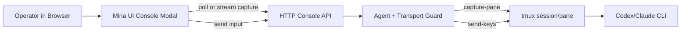

# Tmux Web Console Architecture

## Purpose

Mina Agent Router already uses tmux as the visible execution backend for Codex and Claude agents.

The web console feature should let the operator inspect and lightly interact with those tmux-backed sessions from the Mina UI without opening a terminal app or running `tmux attach`.

This is not a replacement for tmux, xterm, Codex CLI, or Claude Code. It is a local operator console for visibility, recovery, and simple input.

## Product Goal

From the router-centered UI, the user should be able to:

- click an agent node
- choose `Open Console`
- see the current tmux pane output
- send simple text input or Enter to that agent
- inspect whether the agent is waiting, asking for approval, or actively responding
- fall back to `tmux attach` for complex terminal interactions

## Non-Goals

The first web console version must not attempt to be a full terminal emulator.

Out of scope:

- xterm.js-grade terminal emulation
- full alternate-screen rendering
- mouse interactions inside the terminal
- shell job control
- remote browser sharing
- multi-user collaborative terminal access
- streaming binary output
- hidden background agent sessions
- permission bypass for Codex or Claude approval prompts

## Current Foundation

Already available:

- `Agent.sessionId`
- `Agent.tmuxTarget`
- `TmuxClient.capturePane`
- `TmuxClient.sendKeys`
- HTTP UI
- per-agent context menu
- agent detail modal
- tmux restart controls
- `codex --no-alt-screen` startup path

The web console should build on these primitives instead of introducing a separate terminal backend.

## Proposed Architecture



## HTTP API Shape

### Read Console

```http
GET /api/agents/:id/console
```

Response:

```json
{
  "agent": {
    "id": "minasoftai",
    "sessionId": "codex-minasoftai",
    "transport": "tmux"
  },
  "console": {
    "available": true,
    "capturedAt": "2026-06-28T10:00:00.000Z",
    "lines": ["..."],
    "text": "...",
    "lineCount": 80,
    "truncated": false
  }
}
```

Rules:

- only tmux agents support this endpoint
- missing sessions return a structured error with recovery guidance
- the first version can return plain captured text
- capture should default to the last 120 lines
- callers may request a smaller or larger line count with a safe maximum

### Send Console Input

```http
POST /api/agents/:id/console/input
```

Request:

```json
{
  "text": "yes",
  "enter": true
}
```

Response:

```json
{
  "ok": true,
  "sentAt": "2026-06-28T10:00:00.000Z"
}
```

Rules:

- text input must be plain text
- Enter should be explicit
- empty text with `enter: true` should send only Enter
- control sequences should not be supported in the first version
- the API must reject non-tmux agents
- the API must reject unknown agents

## UI Shape

Agent context menu should add:

- `Open Console`

Console modal should include:

- agent id and status
- current tmux session id
- captured output area
- manual refresh button
- auto-refresh toggle
- text input
- send button
- Enter-only button
- copy attach command button
- missing-session recovery message

The UI should remain diagram-first. The console is an overlay, not a permanent panel.

## Refresh Strategy

Phase 1 should use polling:

- refresh every 1-2 seconds while the modal is open and auto-refresh is enabled
- pause polling when the modal closes
- refresh immediately after sending input

Streaming can be added later with Server-Sent Events or WebSocket after the basic interaction model is proven.

## Safety Model

This is a local-only operator feature, but it still needs guardrails:

- the UI should show which agent will receive input
- the API should only send to a registered local tmux session
- destructive shortcuts and raw control sequences are out of scope initially
- browser input should not silently approve prompts; the user must type or press Enter intentionally
- the API should log request timestamps through existing request or future event history where practical

## Known Risks

- Codex and Claude approval prompts may require nuanced terminal behavior.
- tmux capture output can include stale scrollback.
- `send-keys` quoting can corrupt special characters if not handled carefully.
- Polling can feel laggy for fast terminal output.
- A plain text console cannot render full-screen TUIs accurately.

These are acceptable for the first implementation because the product goal is inspect-and-intervene, not full terminal replacement.

